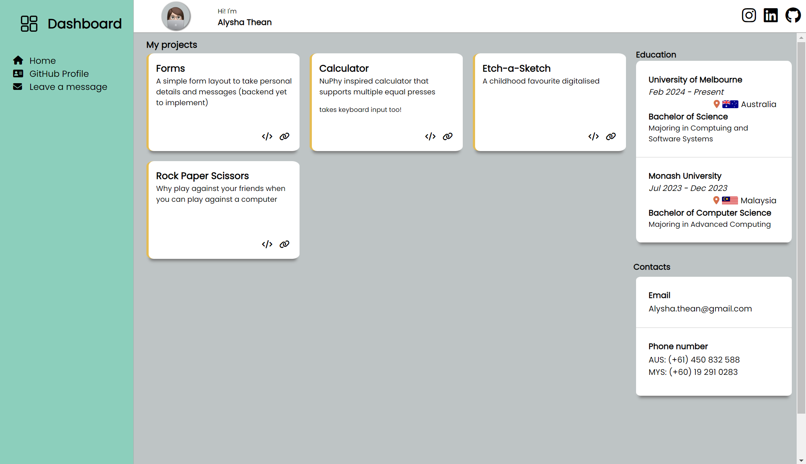

# Dashboard
## Take a look at the live demo [here](https://sushibanana.github.io/Dashboard/)

### Screenshot of Dashboard

### Key takeaways
- use appropriate html tags such as `header`, `footer`, `aside`, `nav` instead of `divs` for improved SEO
- instead of typing all content in one go then only tackling CSS design, settling the overall layout first with background color would be better to eliminate unwanted CSS grid behavior